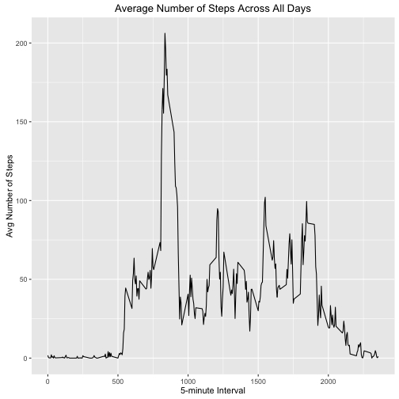

## Loading and preprocessing the data
1. Load the data. This code assumes that the data file is unzipped and at the same directory as this script.


```r
# load libraries to be used in the analysis
library(dplyr)
library(ggplot2)
```


```r
activityData <- read.csv("activity.csv")
str(activityData)
```

```
## 'data.frame':	17568 obs. of  3 variables:
##  $ steps   : int  NA NA NA NA NA NA NA NA NA NA ...
##  $ date    : Factor w/ 61 levels "2012-10-01","2012-10-02",..: 1 1 1 1 1 1 1 1 1 1 ...
##  $ interval: int  0 5 10 15 20 25 30 35 40 45 ...
```

2. Process/transform the data. 


```r
# Convert the date factor to date type.
activityData$validDate <- as.Date(activityData$date, format = "%Y-%m-%d")
str(activityData)
```

```
## 'data.frame':	17568 obs. of  4 variables:
##  $ steps    : int  NA NA NA NA NA NA NA NA NA NA ...
##  $ date     : Factor w/ 61 levels "2012-10-01","2012-10-02",..: 1 1 1 1 1 1 1 1 1 1 ...
##  $ interval : int  0 5 10 15 20 25 30 35 40 45 ...
##  $ validDate: Date, format: "2012-10-01" "2012-10-01" ...
```

## What is mean total number of steps taken per day?
1. Calculate the total number of steps taken per day.


```r
totalSteps <- aggregate(steps ~ validDate, activityData, sum, na.action=na.omit)
head(totalSteps,10)
```

```
##     validDate steps
## 1  2012-10-02   126
## 2  2012-10-03 11352
## 3  2012-10-04 12116
## 4  2012-10-05 13294
## 5  2012-10-06 15420
## 6  2012-10-07 11015
## 7  2012-10-09 12811
## 8  2012-10-10  9900
## 9  2012-10-11 10304
## 10 2012-10-12 17382
```

2. Make a histogram of the total number of steps taken each day.

```r
qplot(totalSteps$steps, geom="histogram", bins=7, main="Histogram of Steps", xlab="Steps", ylab="Frequency")
```


3. Calculate and report the mean and median of the total number of steps taken per day.

Median:

```r
tsMedian <- median(totalSteps$steps)
tsMedian
```

```
## [1] 10765
```

Mean:

```r
tsMean <- mean(totalSteps$steps)
tsMean
```

```
## [1] 10766.19
```

## What is the average daily activity pattern?
1. Make a time series plot of the 5-minute interval (x-axis) and the average number of steps taken, averaged across all days (y-axis)


```r
dailyActivityMean <- aggregate(steps ~ interval, activityData, mean, na.action = na.omit)

ggplot(dailyActivityMean, aes(interval, steps)) + geom_line() + xlab("5-minute Interval") + ylab("Avg Number of Steps") + ggtitle("Average Number of Steps Across All Days")
```



2. Which 5-minute interval, on average across all the days in the dataset, contains the maximum number of steps?


```r
dailyActivityMean %>% 
  filter(steps == max(steps)) %>% 
  select(interval, steps)
```

```
##   interval    steps
## 1      835 206.1698
```

## Imputing missing values
1. Calculate and report the total number of missing values in the dataset (i.e. the total number of rows with NAs)


```r
ok <- complete.cases(activityData)
# count how many are false (i.e. not ok)
sum(!ok)
```

```
## [1] 2304
```

2. Devise a strategy for filling in all of the missing values in the dataset.


```r
# find the breakdown of days with missing values
table(activityData[!ok,4])
```

```
## 
## 2012-10-01 2012-10-08 2012-11-01 2012-11-04 2012-11-09 2012-11-10 
##        288        288        288        288        288        288 
## 2012-11-14 2012-11-30 
##        288        288
```

It looks like the missing data comes from 8 days where there is no data recorded. We can fill in the missing values from the mean interval value that we calculated in the previous section (average daily activity pattern).

The missing step values will be retrieved from the dataframe `dailyActivityMean`.

```r
head(dailyActivityMean,10)
```

```
##    interval     steps
## 1         0 1.7169811
## 2         5 0.3396226
## 3        10 0.1320755
## 4        15 0.1509434
## 5        20 0.0754717
## 6        25 2.0943396
## 7        30 0.5283019
## 8        35 0.8679245
## 9        40 0.0000000
## 10       45 1.4716981
```

3. Create a new dataset that is equal to the original dataset but with the missing data filled in.


```r
# create merged dataset between activityData and avg / interval 
activityData2 <- full_join(activityData, dailyActivityMean, by = "interval")

# create a stepsFixed column
activityData2 <- activityData2 %>% 
  mutate(stepsFixed = ifelse(is.na(steps.x), steps.y, steps.x))

head(activityData2,15)
```

```
##    steps.x       date interval  validDate   steps.y stepsFixed
## 1       NA 2012-10-01        0 2012-10-01 1.7169811  1.7169811
## 2       NA 2012-10-01        5 2012-10-01 0.3396226  0.3396226
## 3       NA 2012-10-01       10 2012-10-01 0.1320755  0.1320755
## 4       NA 2012-10-01       15 2012-10-01 0.1509434  0.1509434
## 5       NA 2012-10-01       20 2012-10-01 0.0754717  0.0754717
## 6       NA 2012-10-01       25 2012-10-01 2.0943396  2.0943396
## 7       NA 2012-10-01       30 2012-10-01 0.5283019  0.5283019
## 8       NA 2012-10-01       35 2012-10-01 0.8679245  0.8679245
## 9       NA 2012-10-01       40 2012-10-01 0.0000000  0.0000000
## 10      NA 2012-10-01       45 2012-10-01 1.4716981  1.4716981
## 11      NA 2012-10-01       50 2012-10-01 0.3018868  0.3018868
## 12      NA 2012-10-01       55 2012-10-01 0.1320755  0.1320755
## 13      NA 2012-10-01      100 2012-10-01 0.3207547  0.3207547
## 14      NA 2012-10-01      105 2012-10-01 0.6792453  0.6792453
## 15      NA 2012-10-01      110 2012-10-01 0.1509434  0.1509434
```

4. Make a histogram of the total number of steps taken each day and calculate and report the mean and median total number of steps taken per day. Do these values differ from the estimates from the first part of the assignment? What is the impact of imputing missing data on the estimates of the total daily number of steps?


```r
# aggregate data again
totalSteps2 <- aggregate(stepsFixed ~ validDate, activityData2, sum, na.action=na.omit)

qplot(totalSteps2$stepsFixed, geom="histogram", bins=7, 
      main="Histogram of Steps with Imputed Values", 
      xlab="Steps", ylab="Frequency")
```


Median:

```r
tsMedianImputed <- median(totalSteps2$stepsFixed)
tsMedianImputed
```

```
## [1] 10766.19
```

Mean:

```r
tsMeanImputed <- mean(totalSteps2$stepsFixed)
tsMeanImputed
```

```
## [1] 10766.19
```

Comparison of original vs imputed median:

```r
data.frame(tsMedian, tsMedianImputed)
```

```
##   tsMedian tsMedianImputed
## 1    10765        10766.19
```

Comparison of original vs imputed mean:

```r
data.frame(tsMean, tsMeanImputed)
```

```
##     tsMean tsMeanImputed
## 1 10766.19      10766.19
```

When imputing missing step values with the mean values :

* The median changes a little bit
* The mean does not change
* The imputed mean and median are the same

## Are there differences in activity patterns between weekdays and weekends?
1. Create a new factor variable in the dataset with two levels - `weekday` and `weekend` indicating whether a given date is a weekday or weekend day


```r
activityData2 <- activityData2 %>%
  mutate(day = ifelse(weekdays(validDate) == "Saturday" |
                        weekdays(validDate) == "Sunday", 
                      "weekend", "weekday"))
# convert to factor
activityData2$day <- as.factor(activityData2$day)

str(activityData2)
```

```
## 'data.frame':	17568 obs. of  7 variables:
##  $ steps.x   : int  NA NA NA NA NA NA NA NA NA NA ...
##  $ date      : Factor w/ 61 levels "2012-10-01","2012-10-02",..: 1 1 1 1 1 1 1 1 1 1 ...
##  $ interval  : int  0 5 10 15 20 25 30 35 40 45 ...
##  $ validDate : Date, format: "2012-10-01" "2012-10-01" ...
##  $ steps.y   : num  1.717 0.3396 0.1321 0.1509 0.0755 ...
##  $ stepsFixed: num  1.717 0.3396 0.1321 0.1509 0.0755 ...
##  $ day       : Factor w/ 2 levels "weekday","weekend": 1 1 1 1 1 1 1 1 1 1 ...
```

```r
head(activityData2,10)
```

```
##    steps.x       date interval  validDate   steps.y stepsFixed     day
## 1       NA 2012-10-01        0 2012-10-01 1.7169811  1.7169811 weekday
## 2       NA 2012-10-01        5 2012-10-01 0.3396226  0.3396226 weekday
## 3       NA 2012-10-01       10 2012-10-01 0.1320755  0.1320755 weekday
## 4       NA 2012-10-01       15 2012-10-01 0.1509434  0.1509434 weekday
## 5       NA 2012-10-01       20 2012-10-01 0.0754717  0.0754717 weekday
## 6       NA 2012-10-01       25 2012-10-01 2.0943396  2.0943396 weekday
## 7       NA 2012-10-01       30 2012-10-01 0.5283019  0.5283019 weekday
## 8       NA 2012-10-01       35 2012-10-01 0.8679245  0.8679245 weekday
## 9       NA 2012-10-01       40 2012-10-01 0.0000000  0.0000000 weekday
## 10      NA 2012-10-01       45 2012-10-01 1.4716981  1.4716981 weekday
```

2. Make a panel plot containing a time series plot of the 5-minute interval (x-axis) and the average number of steps taken, averaged across all weekday days or weekend days (y-axis).


```r
# calculate the mean for each factor
dailyActivityMean2 <- aggregate(stepsFixed ~ interval + day, activityData2, mean, na.action = na.omit)

ggplot(dailyActivityMean2, aes(interval, stepsFixed)) + 
  geom_line() + facet_wrap(~day, nrow=2) + 
  xlab("Interval") + ylab("Number of steps")
```


